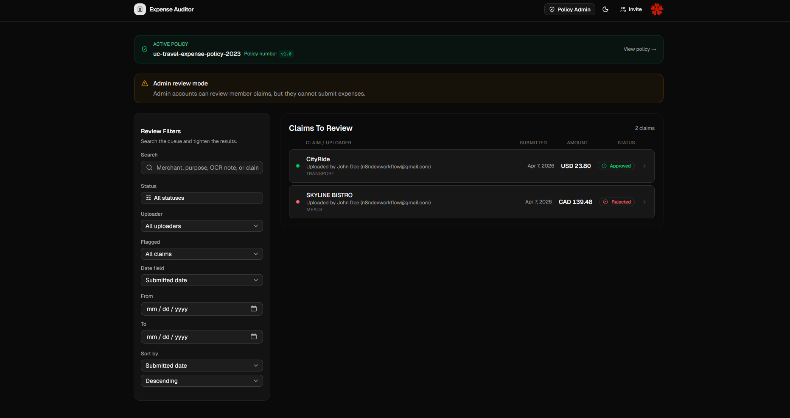
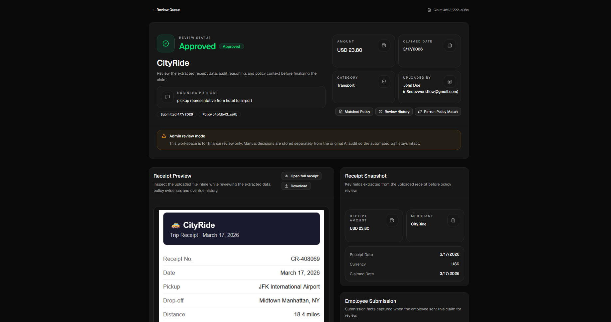
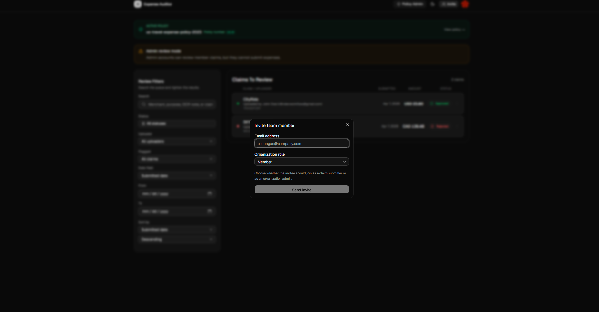
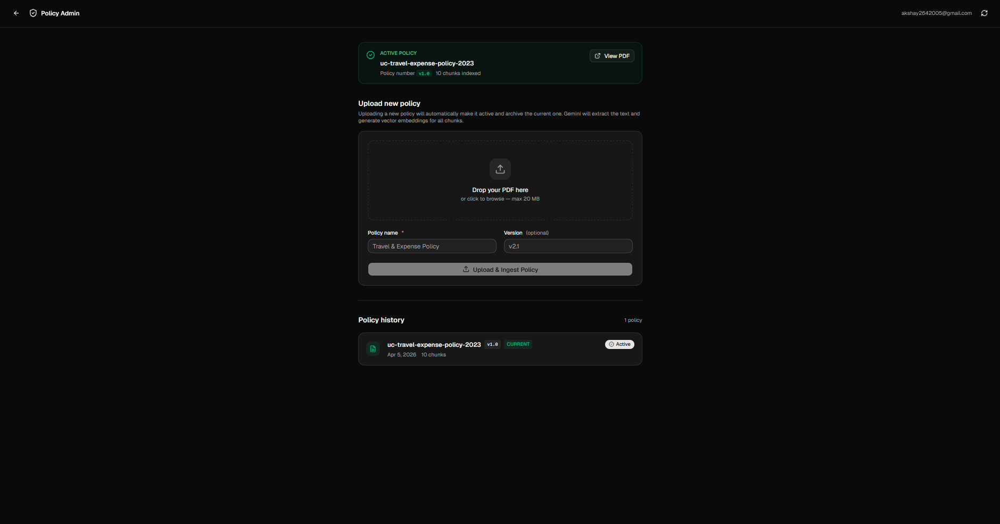

# Expense Auditor

AI-assisted, policy-first expense auditing for OCR-driven claim review, policy validation, and finance-team oversight.

Expense Auditor is a monorepo implementation of the product brief in [2.Expense auditor.pdf](./2.Expense%20auditor.pdf). It combines receipt OCR, policy retrieval, automated audit reasoning, and a finance-admin review workflow so organizations can move from manual reimbursement review to a faster and more consistent process.

## Project Title

Expense Auditor

## The Problem

Expense reimbursement review is often slow, inconsistent, and difficult to scale. Finance teams have to manually inspect receipts, compare them against policy PDFs, and decide whether a claim should be approved, flagged, or rejected, which creates delays and leaves room for human error or policy drift.

## The Solution

Expense Auditor solves this by combining OCR, policy retrieval, and AI-assisted auditing into a single workflow for employees and finance admins. Employees can submit receipt-backed claims, the backend extracts and evaluates the receipt against the active policy, and admins can review, override, and audit the final decision inside a dedicated review workspace.

## Tech Stack

| Category | Technologies |
| --- | --- |
| Programming Languages | Go, TypeScript |
| Frontend | React 19, Vite, React Router, React Query, Clerk React |
| Backend | Go, Echo, Asynq |
| Databases And State | PostgreSQL, pgvector, Redis |
| APIs And Third-Party Tools | Gemini API, Google Cloud Storage, Clerk, Resend, Terraform, Dokploy |

## Screenshots

| Area | Preview |
| --- | --- |
| Admin review queue |  |
| Claim review workspace |  |
| Invitation flow |  |
| Policy administration |  |

## What Ships Today

### Employee experience

- Custom Clerk sign-in and sign-up flows with CAPTCHA support
- SSO callback handling and in-app invitation acceptance
- Organization onboarding and active-org activation
- Claim submission with `JPG`, `PNG`, or `PDF` receipts
- Business purpose, expense date, and category capture
- Claim tracking under `/claims`
- Claim detail pages with audit explanations and cited policy text
- Active policy visibility and PDF download for every signed-in member

### Policy and audit pipeline

- OCR extraction of merchant, amount, currency, and receipt date
- OCR validation for unreadable receipts and date mismatch
- Business-purpose consistency checks during the OCR pipeline
- Policy PDF upload, activation, storage, chunking, embedding, and retrieval
- Gemini-backed audit decisions using retrieved policy context
- Claim outcomes across `approved`, `flagged`, `rejected`, and workflow statuses
- Outcome email notifications for approved, rejected, and clarification-needed claims

### Finance-admin workflow

- Dedicated admin routes under `/admin/claims`, `/admin/claims/:id`, `/admin/profile`, and `/admin/policy`
- Admin review queue with uploader visibility
- Local search, filter, and sort after the initial authorized admin fetch
- Admin claim detail workspace with:
  - receipt preview
  - receipt snapshot
  - employee submission metadata
  - matched policy popup
  - review history popup
- Manual reviewer overrides with comments while preserving the original AI audit trail
- Policy recompute from the admin review page
- Admin/member invite role selection
- Admin profile tabs for `Me` and `Members`
- Promote and demote member roles from the admin profile

## Current Gaps

These are the largest product areas still open relative to the original brief:

- explicit risk scoring and risk-first queue ranking
- analytics and export tooling for finance teams
- richer policy rule enforcement for region, seniority, exceptions, and explicit prohibitions
- in-app notification center and notification preferences
- dispute, reopen, and escalation workflow beyond the current override flow

## Monorepo Layout

```text
expense-auditor/
|-- apps/
|   |-- backend/      # Go API, jobs, storage, OCR, audit, email, migrations
|   `-- frontend/     # React app for employees and finance admins
|-- packages/
|   |-- infra/        # Terraform for a minimal DigitalOcean droplet used with Dokploy
|   |-- openapi/      # ts-rest contracts + generated OpenAPI output
|   `-- zod/          # Shared schemas and TypeScript types
|-- docs/
|   `-- digitalocean-deployment.md
|-- 2.Expense auditor.pdf
|-- README.md
`-- turbo.json
```

## Architecture

### Backend

- Go `1.25`
- Echo API
- PostgreSQL + pgvector
- Redis + Asynq background jobs
- Google Cloud Storage for receipts and policy files
- Gemini for OCR, policy extraction, embedding, business-purpose checks, and audit reasoning
- Clerk for auth and org-aware authorization
- Resend for transactional email

### Frontend

- React `19` + Vite
- React Router
- React Query
- Clerk React
- Shared contracts and schema types from `packages/openapi` and `packages/zod`

### Shared packages

- `@auditor/zod` is the shared schema source of truth
- `@auditor/openapi` defines the contract layer and generates OpenAPI JSON
- `packages/infra` provisions the minimal DigitalOcean droplet used by the current Dokploy deployment path

## Local Development

### Prerequisites

- Go `1.25+`
- Node.js `22+`
- Bun `1.2+`
- Docker Desktop or another Docker runtime
- `task`
- `tern`

Helpful install commands:

```bash
go install github.com/go-task/task/v3/cmd/task@latest
go install github.com/jackc/tern/v2@latest
```

### 1. Install monorepo dependencies

```bash
cd C:\dev\Projects\expense-auditor
bun install
```

### 2. Install backend Go dependencies

```bash
cd C:\dev\Projects\expense-auditor\apps\backend
go mod download
```

### 3. Start local Postgres and Redis

```bash
cd C:\dev\Projects\expense-auditor\apps\backend
docker compose up -d
```

Default local ports:

- PostgreSQL: `localhost:15432`
- Redis: `localhost:16316`

### 4. Configure the backend

Copy the sample:

```bash
cd C:\dev\Projects\expense-auditor\apps\backend
Copy-Item .env.sample .env
```

Minimum values to verify:

```dotenv
EXPAU_PRIMARY.ENV="local"

EXPAU_SERVER.PORT="8080"
EXPAU_SERVER.CORS_ALLOWED_ORIGINS="http://localhost:5173"

EXPAU_DATABASE.HOST="localhost"
EXPAU_DATABASE.PORT="15432"
EXPAU_DATABASE.USER="postgres"
EXPAU_DATABASE.PASSWORD="postgres"
EXPAU_DATABASE.NAME="auditor"
EXPAU_DATABASE.SSL_MODE="disable"

EXPAU_REDIS.ADDRESS="localhost:16316"

EXPAU_AUTH.SECRET_KEY="your-clerk-secret-key"
EXPAU_INTEGRATION.RESEND_API_KEY="your-resend-api-key"
EXPAU_INTEGRATION.RESEND_FROM="Expense Auditor <onboarding@your-domain.com>"

EXPAU_AI.GEMINI_API_KEY="your-gemini-api-key"
EXPAU_AI.DATE_MISMATCH_THRESHOLD="7"

EXPAU_STORAGE.GCS_BUCKET_NAME="your-gcs-bucket"
EXPAU_STORAGE.GCS_PROJECT_ID="your-gcp-project"
EXPAU_STORAGE.GCS_CREDENTIALS="path-or-json-for-service-account"
EXPAU_STORAGE.MAX_FILE_SIZE_MB="10"
```

### 5. Configure the frontend

Create `apps/frontend/.env`:

```dotenv
VITE_CLERK_PUBLISHABLE_KEY=pk_test_or_pk_live_value
VITE_API_URL=http://localhost:8080
VITE_ENV=local
```

### 6. Run migrations

```bash
cd C:\dev\Projects\expense-auditor\apps\backend
task migrations:up
```

### 7. Build the shared packages once

```bash
cd C:\dev\Projects\expense-auditor\packages\zod
bun run build

cd C:\dev\Projects\expense-auditor\packages\openapi
bun run build
bun run gen
```

### 8. Start the backend

```bash
cd C:\dev\Projects\expense-auditor\apps\backend
task run
```

The API will be available at `http://localhost:8080`.

### 9. Start the frontend

Open a second terminal:

```bash
cd C:\dev\Projects\expense-auditor
bun dev
```

The frontend typically runs at `http://localhost:5173`.

## Common Commands

### Root

```bash
bun dev
bun build
bun typecheck
bun lint
```

### Backend

```bash
cd apps/backend
task run
task migrations:up
go test ./...
```

### Frontend

```bash
cd apps/frontend
bun run dev
bun run typecheck
bun run build
```

### Shared packages

```bash
cd packages/zod
bun run build

cd packages/openapi
bun run build
bun run gen
```

## Documentation Map

- [Backend README](./apps/backend/README.md)
- [Frontend README](./apps/frontend/README.md)
- [Zod README](./packages/zod/README.md)
- [OpenAPI README](./packages/openapi/README.md)
- [Infra README](./packages/infra/README.md)
- [DigitalOcean + Dokploy Deployment Guide](./docs/digitalocean-deployment.md)

## Deployment

The current documented production path for this repo is:

1. Provision a minimal DigitalOcean droplet with Terraform from `packages/infra`
2. Install Dokploy on that droplet
3. Run PostgreSQL + pgvector and Redis as a Dokploy compose stack
4. Deploy the frontend and backend as separate Dokploy applications

See:

- [packages/infra/README.md](./packages/infra/README.md)
- [docs/digitalocean-deployment.md](./docs/digitalocean-deployment.md)

## Recommended Next Product Steps

1. Add risk scoring and rank the admin queue by risk by default.
2. Add analytics, CSV export, and saved review views for finance admins.
3. Expand policy enforcement beyond caps and retrieved text into structured rule categories.
4. Add an in-app notification center and user-facing notification preferences.
5. Add reopen, escalation, and dispute handling on top of the current override trail.

## License

This repository is licensed under the terms in [LICENSE](./LICENSE).
